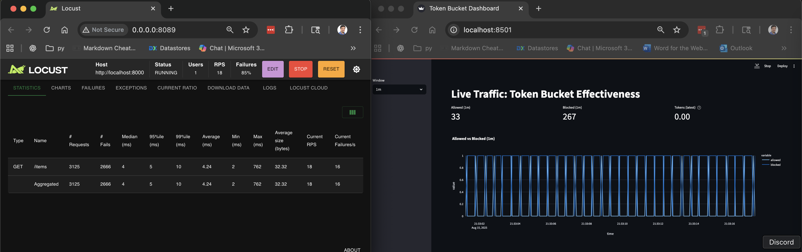

# rate-limited-fastapi

A Python 3.12.3 project demonstrating a **FastAPI** app protected by a **Redis-backed token
bucket** (Lua script), a **Locust** load generator, and a **Streamlit** dashboard with
time‑series charts. Includes strong Python best practices: `black`, `isort`, `flake8`, `mypy`,
`pytest` + coverage, and `pre-commit` hooks.



## Quick start

```bash
# 1) Create and activate a virtualenv (recommended)
python3.12 -m venv .venv && source .venv/bin/activate

# 2) Install deps
pip install -r requirements.txt

# 3) Start Redis (Docker)
./scripts/run_redis.sh

# 4) Start FastAPI
uvicorn app.main:app --reload

# 5) (Optional) Preload the Lua script
python scripts/setup_redis.py

# 6) Run the dashboard
streamlit run dashboard/app.py

# 7) Run load (separate terminal)
locust -f load/locustfile.py --host=http://localhost:8000
```

## What’s inside

- **FastAPI** app at `app/main.py` that enforces rate limits using **Redis Lua** (token bucket).
- **Hardened Lua** at `rate_limiter.lua`: uses Redis `TIME`, clamps elapsed, caps tokens, TTL.
- **Metrics**: simple `/metrics` endpoint exposes allowed vs throttled counts and current tokens.
- **Streamlit dashboard** at `dashboard/app.py` showing time-series of pass vs throttle and token count.
- **Locust** load at `load/locustfile.py` to prove the limiter works.
- **Tests** in `tests/` covering token refill/allow/deny behavior.
- Best-practice tooling: `black`, `flake8`, `isort`, `mypy`, `pytest`, `pytest-cov`, `pre-commit`.

## Configuration

Edit `.env` (or env vars) to tune limits:

```
REDIS_URL=redis://localhost:6379/0
TB_CAPACITY=20          # max tokens (burst)
TB_RATE=20              # tokens per second
BUCKET_PREFIX=tb:user:  # key prefix
```

## Token bucket rationale

We use **continuous (lazy) refill**: tokens added = `rate * elapsed_ms/1000`, clamped to capacity, and
applied atomically in Redis to avoid races. This avoids fixed-window boundary spikes and maintains a
rolling, fair limit.

## Security notes

- The Lua script only accepts numeric inputs and clamps elapsed times to avoid clock skew effects.
- We use Redis `TIME` (server time) for consistency.
- Keys expire after *full refill time* of idleness to reclaim memory.

## Make it yours

- Change identification policy (per-IP, per-API key, per-user) in `app/main.py`.
- Extend metrics (Prometheus compatible) or feed logs to your observability stack.
- Deploy behind Hitch/HAProxy/Nginx/Envoy if you need TLS/WAF/routing ahead of FastAPI.

MIT License.
