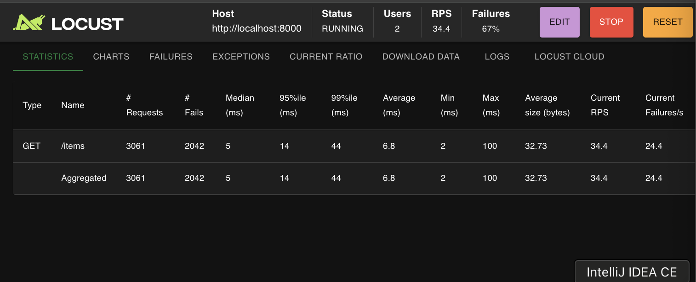
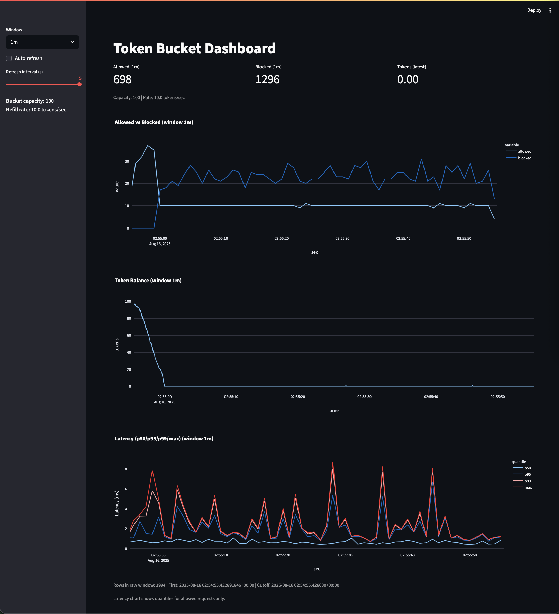
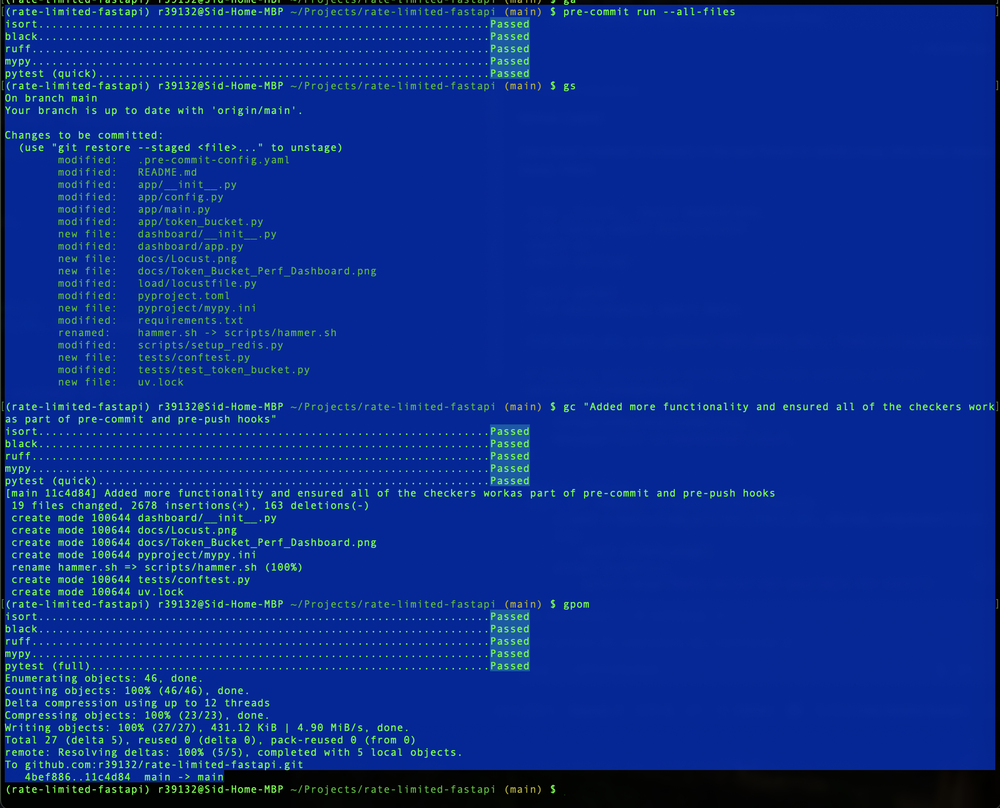

<!-------->
[](https://www.python.org/)
[](https://fastapi.tiangolo.com/)
[](https://www.uvicorn.org/)
[](https://redis.io/)
[](https://streamlit.io/)
[](https://locust.io/)
[](https://black.readthedocs.io/)


[](https://pre-commit.com/)
[](./LICENSE)
---


# rate-limited-fastapi

A Python 3.12.3 project demonstrating a **FastAPI** app protected by a **Redis-backed token
bucket** (Lua script), a **Locust** load generator, a **Streamlit** dashboard with
time-series charts, and a **`hammer.sh`** script for shell-based load testing.  
Includes strong Python best practices: `black`, `isort`, `ruff`, `mypy`,
`pytest` + coverage, and both `pre-commit` & `pre-push` hooks.

---
## Screenshots
### Locust (Load Generator) Dashboard


### Performance Dashboard



---

## Quick start

## One-Time Setup
### 0) Install [uv](https://docs.astral.sh/uv/)
```bash
# Install via Curl
curl -Ls https://astral.sh/uv/install.sh | sh
# or via Pipx (Recommended)
pipx install uv
```

### 1) Create and sync a virtual environment
```bash
uv venv --python 3.12.3
uv sync
```
This will create `.venv` and install all runtime + dev dependencies from `pyproject.toml` / `uv.lock`.

### 2) Install Required Packages
```bash
docker pull redis:7-alpine
```

### 3) Install [precommit/prepush hooks](https://pre-commit.com/#3-install-the-git-hook-scripts)
```bash
pre-commit install --hook-type pre-commit
pre-commit install --hook-type pre-push
```

## Everytime

### 3) Start Redis (Docker)
```bash
./scripts/run_redis.sh
```

### 4) Preload the Lua script (optional)
```bash
uv run python scripts/setup_redis.py
```

### 5) Run the API server
```bash
uv run uvicorn app.main:app --reload
```

### 6) Run the dashboard
```bash
uv run streamlit run dashboard/app.py
```

### 7) Run load tests
- **Option 1: Locust (browser UI)**
  ```bash
  uv run locust -f load/locustfile.py --host=http://localhost:8000
  ```
  Open <http://localhost:8089>.

- **Option 2: Hammer script (shell alternative)**
  ```bash
  ./hammer.sh
  ```

---

## What’s inside

- **FastAPI** app at `app/main.py` enforcing rate limits with **Redis Lua** (token bucket).
- **Hardened Lua** at `rate_limiter.lua`: uses Redis `TIME`, clamps elapsed, caps tokens, TTL.
- **Metrics**: `/metrics` endpoint exposes allowed vs throttled counts and current tokens.
- **Streamlit dashboard** at `dashboard/app.py` (time-series of pass vs throttle and token count).
- **Locust** load at `load/locustfile.py` to stress test the limiter.
- **Hammer script** at `hammer.sh` for quick shell-based load testing.
- **Tests** in `tests/` covering token refill/allow/deny behavior.
- **Best-practice tooling**: `black`, `flake8`, `isort`, `mypy`, `pytest`, `pytest-cov`, `pre-commit`.

---

## Configuration

### Tune Token Bucket Capacity and Refill Rate
Edit `.env` (or env vars) to tune limits:

```bash
REDIS_URL=redis://localhost:6379/0
TB_CAPACITY=20          # max tokens (burst)
TB_RATE=20              # tokens per second
BUCKET_PREFIX=tb:user:  # key prefix
```

### Create a Secrets file (Needed by Steamlit Dashboard)
To run the dashboard, you’ll need to create a secrets file:

```bash
cp ./dashboard/.streamlit/secrets.example.toml ./dashboard/.streamlit/secrets.toml
```

---

## Token bucket rationale & Retry-After enhancement

The Redis Lua token bucket implements lazy (continuous) refill:

```
tokens_added = rate * elapsed_ms / 1000
```

The enhanced Lua script now also returns an explicit `retry_after` (whole seconds) so clients know how long to wait before retrying:

- Script return order: `allowed`, `remaining_tokens`, `retry_after_seconds`
- `retry_after == 0`: request allowed (or immediately retryable after consumption)
- `retry_after > 0`: client should wait that many whole seconds
- `retry_after == -1`: request can never succeed (requested > capacity or refill rate <= 0); the API omits the `Retry-After` header in that case

Example Request with 429 response:
```
http://localhost:8000/items

HTTP/1.1 429 Too Many Requests
date: Sat, 16 Aug 2025 20:46:19 GMT
server: uvicorn
x-ratelimit-capacity: 20
x-ratelimit-rate: 5.0
x-ratelimit-remaining: 0.00
retry-after: 1
content-length: 48
content-type: application/json

{"detail":"rate limit exceeded","retry_after":1}
```

Blog post with more detail:  
https://www.linkedin.com/pulse/fun-coding-friday-rate-limiting-redis-sid-anand-d8svf

## Development
- Add new dependencies:
  ```bash
  uv add <package>
  uv add --group dev <dev-package>
  ```

- Update dependencies:
  ```bash
  uv lock --upgrade
  uv sync
  ```

- Run tests:
  ```bash
  uv run pytest
  ```

- Run pre-commit checks before committing and pushing to git
  ```bash
  pre-commit run --all-files
  ```
Refer to the Screenshot below:


Note: Most of the checks will autofix code, so if they fail the first time, just run again. Even if you forget to run `pre-commit run --all-files`, they checks will run when you try to commit or push

---

## Deployment

If you need a `requirements.txt` (for Docker or pip-only environments):

```bash
uv pip compile pyproject.toml -o requirements.txt
```

---

## License

MIT
